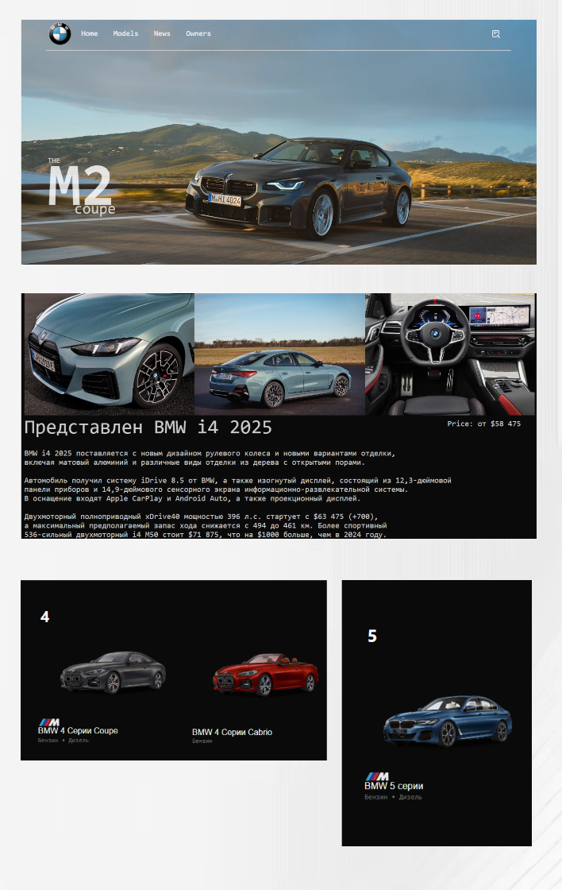

<h1 align="center"> Fan website BMW </h1>
<h3>Ru</h3>
<h4>
 Создавая сайт для поклонников BMW, я стремился сделать
 его максимально удобным для просмотра на мониторах с разрешением 
 1366 на 768. На сайте представлены более 30 моделей BMW, включая M3, 
 M4, M5, M2, X7 и многие другие. На данный момент сайт предоставляет базовый 
 функционал, позволяющий ознакомиться с информацией о BMW M2. На страницах "Home", "News" 
 и "Owners" изображения будут подстраиваться под экраны с расширением 1920 на 1080. 
</h4>

<h3>En</h3>
<h4>
 When creating a site for BMW fans, I tried to make it as convenient as possible for viewing on monitors with a resolution of 1366 by 768. The site features more than 30 BMW models, including M3, M4, M5, M2, X7 and many others. At the moment, the site provides basic functionality that allows you to get acquainted with information about the BMW M2. On the "Home", "News" and "Owners" pages, images will be adjusted to fit 1920 x 1080 screens.</h4>

