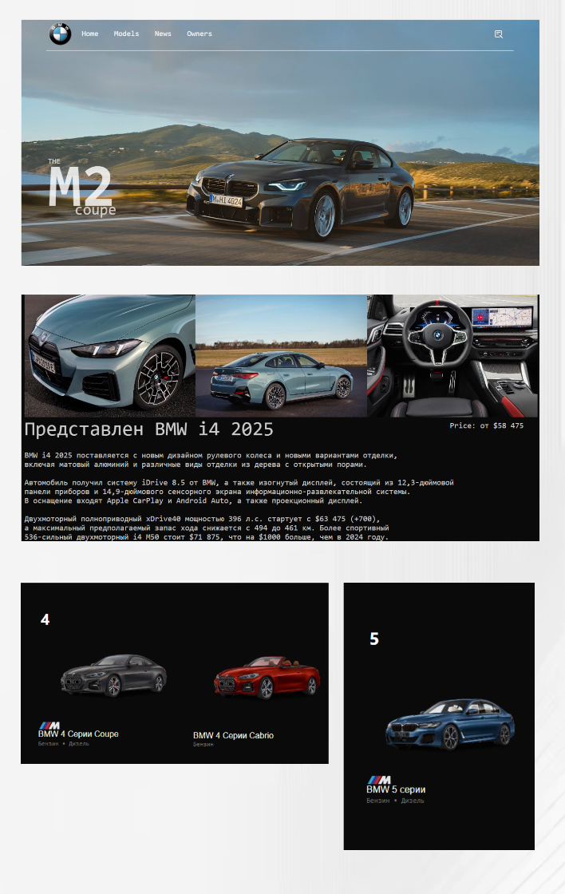

<h1 align="center"> Fan website BMW </h1>
<h3>Ru</h3>
<h4>
Представьте себе: элегантный веб-сайт, посвященный легендарной марке BMW, разработанный с учетом потребностей современного пользователя. Он создан не просто как каталог, а как виртуальный мир, где каждый сможет погрузиться в мир роскоши и высоких технологий. Сайт оптимизирован для комфортного просмотра на экранах с разрешением 1366x768 пикселей, что обеспечивает доступность информации для широкого круга пользователей.

Более 30 моделей BMW, от культовой "тройки" до мощного X7 и эксклюзивных автомобилей серии M, представлены в тщательно составленном каталоге. Каждая модель – это отдельная история, раскрытая через высококачественные изображения, подробные технические характеристики и увлекательные описания.

Особое внимание уделено BMW M2 Купе – настоящему воплощению спортивного духа BMW. Его страница – это не просто техническое описание, а гимн динамике и мощности. Здесь представлены захватывающие дух фотографии, демонстрирующие изысканность дизайна и агрессивную эстетику автомобиля. Подробнейшие технические характеристики, включающие данные о двигателе, трансмиссии и ходовой части, позволят оценить всю мощь и управляемость этого спортивного купе.  

В настоящее время сайт находится на стадии активного развития. Пока что основное внимание уделено предоставлению максимально полной информации о BMW M2 Купе. Однако, в будущем планируется расширить функционал, добавив более подробные описания для всех моделей. Разделы "Главная", "Новости" и "Для владельцев" будут адаптированы для экранов с высоким разрешением (1920x1080), обеспечивая максимально комфортный просмотр для пользователей с различными типами устройств. Таким образом, создается не просто статичный ресурс, а постоянно развивающийся и совершенствующийся онлайн-портал, посвященный миру BMW.
</h4>

   

<h3>En</h3>
<h4>
Imagine this: an elegant website dedicated to the legendary BMW brand, designed with the needs of the modern user in mind. It was created not just as a catalog, but as a virtual world where everyone can immerse themselves in the world of luxury and high technology. The site is optimized for comfortable viewing on screens with a resolution of 1366 x 768 pixels, which ensures that information is accessible to a wide range of users.

More than 30 BMW models, from the iconic Troika to the powerful X7 and exclusive M-series cars, are presented in a carefully compiled catalog. Each model is a different story, revealed through high–quality images, detailed technical specifications, and fascinating descriptions.

Special attention is paid to the BMW M2 Coupe, the true embodiment of BMW's sporting spirit. His page is not just a technical description, but an anthem to dynamics and power. Here are breathtaking photos showing the sophistication of the design and the aggressive aesthetics of the car. The detailed technical specifications, including data on the engine, transmission and chassis, will allow you to evaluate the full power and handling of this sports coupe.

The site is currently under active development. So far, the focus is on providing the most complete information about the BMW M2 Coupe. However, it is planned to expand the functionality in the future by adding more detailed descriptions for all models. The "Home", "News" and "For Owners" sections will be adapted for high-resolution (1920x1080) screens, providing the most comfortable viewing experience for users with various types of devices. This creates not just a static resource, but an ever-evolving and improving online portal dedicated to the BMW world.
</h4>

